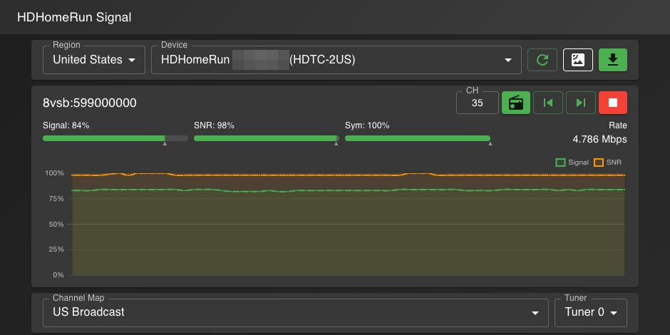
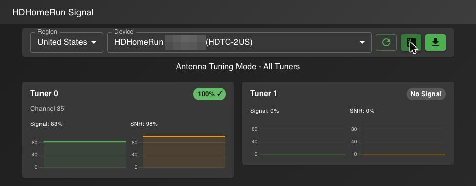

# HDHomeRun Signal Monitor

[](https://github.com/cyberglitchlabs/hdhomerunsignal/actions/workflows/release.yml)
[](https://github.com/cyberglitchlabs/hdhomerunsignal/actions/workflows/codeql.yml)

A modern web application that replaces the discontinued HDHomeRun Signal Android app. This web app provides real-time signal monitoring, channel tuning, and device management for HDHomeRun devices in the United States, Canada, United Kingdom/EU and Australia.

It runs as a small container on your network (Docker, Docker Compose or Kubernetes), close to your antenna, and works from any browser or phone.

> This project is a fork of [Petelombardo/hdhomerunsignal](https://github.com/Petelombardo/hdhomerunsignal), the original HDHomeRun Signal Monitor by Pete Lombardo, who deserves the credit for the app itself. This fork adds a hardened container image, CI with vulnerability scanning and signed images, and a Helm chart for Kubernetes, along with some security hardening.

## Features

- **Multi-Region Support**: Supports US/Canada (ATSC), UK/EU (DVB-T/T2) and Australia (DVB-T) broadcast standards with region-specific channel maps
- **Device Discovery**: Automatically finds HDHomeRun devices on your network
- **Real-time Signal Monitoring**: Live updates of signal strength, SNR quality, and symbol quality with dBm/dB estimates
- **Session Markers**: Each signal meter (strength, SNR, symbol quality) shows three reference points for the current channel: the live reading, a faded high-water mark showing the best reading so far, and a ▲ caret marking the starting reading from when the channel first locked. Hover over a meter to see Now / Start / Peak values.
- **Antenna Tuning Mode**: Monitor all tuners simultaneously with real-time graphs for optimal antenna positioning
- **Direct Channel Tuning**: Quickly tune to specific channels with channel up/down controls
- **Multi-tuner Support**: Switch between tuners on devices that support multiple tuners
- **ATSC 3.0 Support**: Displays PLP and L1 information for NextGen TV broadcasts (US)
- **Watch Live TV**: Click to watch any detected program in your local media player (VLC, mpv, etc.) via M3U playlist, with right-click option to copy the stream URL
- **Program Detection**: Automatically shows available programs/PIDs on tuned channels
- **Progressive Web App**: Install on mobile devices for a native app experience
- **Responsive Design**: Works on both desktop and mobile devices
- **Modern UI**: Clean, dark theme interface with Material-UI components

## Screenshots

Main view: live meters with session markers and a 60-second signal/SNR history



Antenna mode: every tuner at a glance



The original Android app functionality has been recreated and enhanced with:
- Region selection (US / Canada / UK-EU / Australia) with appropriate broadcast standards
- Device selection dropdown
- Real-time signal strength, SNR quality, and symbol quality meters with dB conversion
- Session markers on each meter showing start point, peak (high-water mark) and current reading
- **Antenna tuning mode** - simultaneous monitoring of all tuners with real-time graphing (new!)
- Direct channel tuning with up/down controls
- Channel map selection (region-specific: US/CA broadcast/cable/HRC/IRC, UK-EU broadcast/cable or AU broadcast/cable)
- Data rate monitoring
- Program/PID listing for tuned channels with Watch buttons
- Watch live TV directly from the app using M3U stream URLs
- ATSC 3.0 advanced information display (US)
- Automatic reconnection after network interruptions

## Prerequisites

- Docker and Docker Compose, or a Kubernetes cluster
- HDHomeRun device(s) on your network
- For automatic device discovery, the container needs host networking, because discovery is a network broadcast. If the broadcast finds nothing, pressing refresh falls back to SiliconDust's discovery service (`ipv4-api.hdhomerun.com`). To keep local discovery but never make that outside lookup, set `HDHR_DISABLE_CLOUD_DISCOVERY=true`. To turn off discovery entirely, list your tuners in `HDHOMERUN_DEVICES` and set `HDHOMERUN_DISABLE_DISCOVERY=true`.

### System Requirements

**Prebuilt container images** are published for:
- **x86_64** (AMD64) - Traditional desktops and servers
- **ARM64** (aarch64) - Raspberry Pi 4/5, Orange Pi, Banana Pi, and other ARMv8 SBCs

**Recommended hardware:** Raspberry Pi 4 or newer, or other ARMv8-based single-board computers. These provide:
- Low power consumption (perfect for 24/7 operation)
- Small form factor (can be placed near your antenna/HDHomeRun)
- More than sufficient processing power for signal monitoring
- Cost-effective dedicated hardware

**32-bit ARM (armv7) is not supported.** The base image does not provide that architecture.

The container image automatically selects the right architecture for your platform.

## Installation & Setup

### Docker Compose

Save this as `docker-compose.yml` and run `docker compose up -d`:

```yaml
services:
  hdhomerun-signal:
    image: ghcr.io/cyberglitchlabs/hdhomerunsignal:latest
    network_mode: host          # needed for automatic device discovery
    restart: unless-stopped
    read_only: true
    tmpfs:
      - /tmp
    cap_drop:
      - ALL
    security_opt:
      - no-new-privileges:true
    environment:
      - PORT=3000
      # Optional: add tuners by IP or hostname (also works without host networking)
      #- HDHOMERUN_DEVICES=192.168.1.100,192.168.2.50
      # Optional: only use the devices listed above
      #- HDHOMERUN_DISABLE_DISCOVERY=true
      # Optional: keep local discovery but never ask SiliconDust's cloud service
      #- HDHR_DISABLE_CLOUD_DISCOVERY=true
```

Then open `http://your-server-ip:3000`. The app discovers HDHomeRun devices on your network automatically.

Pin a version tag (for example `:0.1.0`) or an image digest instead of `latest` if you want updates to be deliberate. The container runs as an unprivileged user, so the settings above (read-only filesystem, no capabilities) work without any further configuration.

### Build from source

```bash
git clone https://github.com/cyberglitchlabs/hdhomerunsignal.git
cd hdhomerunsignal
docker compose up -d --build
```

The bundled `docker-compose.yml` publishes port 3000 instead of using host networking, so set `HDHOMERUN_DEVICES` in it (or switch it to `network_mode: host`) so your tuners are found.

### Kubernetes (Helm)

A Helm chart is included in [`charts/hdhomerun-signal`](charts/hdhomerun-signal). Container images are published to `ghcr.io/cyberglitchlabs/hdhomerunsignal` for amd64 and arm64.

```bash
helm install hdhr ./charts/hdhomerun-signal \
  --namespace hdhomerun --create-namespace \
  --set 'hdhomerun.devices={192.168.1.100}'

kubectl -n hdhomerun port-forward svc/hdhr-hdhomerun-signal 8080:80
```

Tagged releases also publish the chart as an OCI artifact:
`helm install hdhr oci://ghcr.io/cyberglitchlabs/charts/hdhomerun-signal --version <version> ...`

**Device discovery.** Discovery works by broadcast, which does not cross the pod network. By default the chart therefore talks only to the tuner IPs or hostnames in `hdhomerun.devices`. To use auto-discovery, set `hostNetwork=true` and `hdhomerun.discovery.enabled=true` and schedule the pod on a node on the same LAN as the tuners. If the broadcast finds nothing, a refresh falls back to SiliconDust's cloud lookup; set `hdhomerun.discovery.cloud=false` to prevent that. `hostNetwork` bypasses pod network isolation (NetworkPolicy does not apply and it does not meet the *restricted* Pod Security Standard), so prefer static device addresses.

**Security defaults.** The pod runs as a non-root user with a read-only root filesystem, no capabilities, the `RuntimeDefault` seccomp profile, and no service account token. A NetworkPolicy limits egress to DNS and the tuner control port (65001) and ingress to the release namespace; use `networkPolicy.ingress.from` to admit your ingress controller. The Ingress is off by default and requires TLS when enabled.

> **The app has no authentication.** Anyone who can reach it can retune your tuners. Keep it on a trusted network, or put it behind an authenticating reverse proxy or VPN.

**Behind an ingress or reverse proxy.** Set `trustProxy` (the `HDHR_TRUST_PROXY` variable) so per-client rate limiting sees each user's real address; `--set trustProxy=1` is right for a single ingress controller directly in front of the pod. Without it every client shares the proxy's address and therefore one rate-limit bucket. Set it to the number of proxies you actually run, or their addresses, and no more: trusting a proxy hop that is not there lets any client spoof its address with an `X-Forwarded-For` header. (Tested with one hop; if a load balancer sits in front of your ingress controller, count both.)

Real-time updates are long-lived Server-Sent Events responses, so the proxy must not buffer or time out `/api/v1/devices/:id/.../stream`. The server sends `X-Accel-Buffering: no` and a keepalive comment every 15 seconds; with nginx-ingress, raise `proxy-read-timeout` above that if you have lowered it.

The proxy must also **preserve the original `Host` header** (nginx-ingress does by default). The API (including the event streams) rejects browser requests whose `Origin` does not match the `Host` they arrive with, and `X-Forwarded-Host` is not consulted. If your proxy rewrites `Host`, list the public origin in `allowedOrigins` (`HDHR_ALLOWED_ORIGINS`) instead.

### Image provenance

Release images are scanned for fixable HIGH/CRITICAL vulnerabilities before publishing, carry an SBOM and SLSA provenance, and are signed with [cosign](https://github.com/sigstore/cosign) using GitHub's OIDC identity (no long-lived keys):

```bash
cosign verify ghcr.io/cyberglitchlabs/hdhomerunsignal:<tag> \
  --certificate-oidc-issuer https://token.actions.githubusercontent.com \
  --certificate-identity-regexp '^https://github.com/cyberglitchlabs/hdhomerunsignal/\.github/workflows/release\.yml@'
```

## Usage

### Normal Mode

1. **Device Selection**: Choose your HDHomeRun device from the dropdown
2. **Tuner Selection**: Select which tuner to monitor/control
3. **Channel Tuning**:
   - Enter a channel number and press the tune button or hit Enter
   - Use the Previous/Next buttons to step through channels
   - The app automatically detects channels tuned by other applications (e.g., tvheadend)
4. **Monitor Signal**: View real-time signal strength (dBm), SNR (dB), and symbol quality. Each meter also shows:
   - **Current**: the solid, color-coded bar
   - **High-water mark**: a faded bar behind it showing the peak reading since you tuned the channel
   - **Starting point**: a ▲ caret under the bar marking the first reading after the channel locked

   Hover over a meter for exact Now / Start / Peak percentages. The markers reset when you change channel, tuner or device, but stay in place through a brief loss of lock, so swinging the antenna won't wipe them. This makes it easy to tell whether an adjustment helped.
5. **View Programs**: See detected programs/PIDs and ATSC 3.0 technical details when available
6. **Watch Live TV**: Each detected program has a **Watch** button that downloads an M3U playlist file, which opens in your default media player (VLC, mpv, etc.) to stream live TV. Right-click the Watch button to **Copy Stream URL** to your clipboard for use in any application.
7. **Channel Map**: Select the appropriate channel map (US Broadcast is default)

### Antenna Tuning Mode

Perfect for aligning your antenna for optimal signal reception:

1. **Activate**: Click the satellite icon button next to the device selector
2. **View All Tuners**: See real-time signal data from all tuners simultaneously in a grid layout
3. **Monitor Symbol Quality**: Each tuner shows a color-coded badge:
   - **Green** (100%): Perfect signal lock - antenna is properly aligned
   - **Red** (<100%): Signal present but poor - keep adjusting
   - **Gray** (0%): No signal detected
4. **Watch the Graphs**: Side-by-side real-time graphs show:
   - **Signal Strength** (left): Overall signal power over last 60 seconds
   - **SNR Quality** (right): Signal-to-noise ratio over last 60 seconds
5. **Optimize Your Antenna**:
   - Prioritize getting Symbol Quality to 100% (green) on all tuned channels
   - Then maximize SNR quality for better reception in varying conditions
   - Signal strength helps with initial rough positioning
6. **Return to Normal Mode**: Click the satellite icon again

## Configuration

### Environment Variables

| Variable | Description | Default |
|----------|-------------|---------|
| `PORT` | Web server port | `3000` |
| `HDHOMERUN_DEVICES` | Comma-separated list of device IPs or hostnames to manually add (supplements auto-discovery) | *(empty)* |
| `HDHOMERUN_DISABLE_DISCOVERY` | Set to `true` to disable auto-discovery (use only manually specified devices) | `false` |
| `HDHR_DISABLE_CLOUD_DISCOVERY` | Set to `true` to keep local broadcast discovery but never fall back to SiliconDust's cloud lookup (`ipv4-api.hdhomerun.com`) when the broadcast finds nothing. Has no effect when `HDHOMERUN_DISABLE_DISCOVERY=true`, which already disables both | `false` |
| `HDHR_CLOUD_DISCOVERY_URL` | URL of the cloud discovery lookup. Meant for tests and alternative backends that need to stub it; `http://` and `https://` both work | `https://ipv4-api.hdhomerun.com/discover` |
| `HDHR_ALLOWED_ORIGINS` | Comma-separated browser origins (e.g. `https://hdhr.example.com`) allowed to call the API cross-origin. Only needed if the UI is served from a different origin than the API | *(empty, same-origin only)* |
| `HDHR_RATE_LIMIT` | Requests per minute allowed per client address (channel scans have a separate, stricter limit). `0` disables limiting | `300` |
| `HDHR_MAX_STREAMS_PER_CLIENT` | How many real-time event streams one client address may hold open at once. Streams are not counted by `HDHR_RATE_LIMIT`, because a browser never retries a stream refused with 429. `0` removes the cap | `16` |
| `HDHR_TRUST_PROXY` | Which reverse proxies may set `X-Forwarded-For`, so rate limiting sees the real client address: a proxy hop count (`1`-`32`) or a comma-separated list of proxy IPs/CIDRs (e.g. `10.42.0.0/16`). `true`, `false`, `0` and zero-length prefixes such as `0.0.0.0/0` are refused, and **an invalid value stops the server from starting**. Leave unset if the app is not behind a proxy | *(empty, trust nothing)* |

**Examples:**

```bash
# Add a specific device on a different subnet
HDHOMERUN_DEVICES=192.168.2.50

# Add multiple devices
HDHOMERUN_DEVICES=192.168.1.100,hdhomerun.local,10.0.0.25

# Disable auto-discovery and only use specified devices
HDHOMERUN_DISABLE_DISCOVERY=true
HDHOMERUN_DEVICES=192.168.1.100,192.168.1.101

# Keep local broadcast discovery, but never ask the SiliconDust cloud service
HDHR_DISABLE_CLOUD_DISCOVERY=true
```

### Region Selection
Select your region (United States, Canada, United Kingdom/EU or Australia) to configure the app for your broadcast standard:
- **United States**: ATSC 1.0/3.0 broadcasts, channels 2-36
- **United Kingdom / EU**: DVB-T/T2 broadcasts, channels 5-60
- **Australia**: DVB-T broadcasts, VHF channels 6-12 (including 9A) and UHF channels 28-51

**Important**: You must have a region-appropriate HDHomeRun device:
- US models work with ATSC broadcasts
- EU models (HDHomeRun Connect Duo EU, etc.) work with DVB-T/T2 broadcasts
- Australian broadcasts need a DVB-T model (the EU/AU hardware)

### Channel Maps

**United States:**
- **US Broadcast**: Standard over-the-air channels
- **US Cable**: Cable TV channels
- **US HRC**: Harmonically Related Carrier cable
- **US IRC**: Incrementally Related Carrier cable

**United Kingdom / EU:**
- **UK/EU Broadcast**: Standard DVB-T/T2 over-the-air channels
- **UK/EU Cable**: Cable TV channels

**Australia:**
- **AU Broadcast**: Standard DVB-T over-the-air channels
- **AU Cable**: Cable TV channels

### Signal Quality Interpretation
- **Signal Strength**: Raw power level (aim for 80%+)
- **SNR Quality**: Signal-to-noise ratio (aim for 80%+)
- **Symbol Quality**: Error correction quality (should be 100% when properly aligned)

## Technical Details

### Architecture
- **Frontend**: React with Material-UI
- **Backend**: Rust (axum), in `crates/`
- **Communication**: REST API + Server-Sent Events for real-time updates
- **HDHomeRun Integration**: Uses `hdhomerun_config` command-line tool

### Container
- Published for `linux/amd64` and `linux/arm64`. The arm64 image runs natively on Apple Silicon Macs (Docker Desktop) and on 64-bit Raspberry Pi OS (Pi 3, 4 and 5). Docker on a Mac has no host networking, so list your tuners in `HDHOMERUN_DEVICES` there. 32-bit Raspberry Pi OS is not supported.
- Multi-stage build on digest-pinned base images: the Rust server and the built frontend in a Debian slim runtime image, `linux/amd64` and `linux/arm64`
- Runs as a non-root user, and works with a read-only root filesystem and all capabilities dropped
- `hdhomerun_config` is installed from the distribution's package repository
- Built-in healthcheck and clean shutdown on `SIGTERM`
- Host networking is only needed for broadcast discovery; otherwise list tuners in `HDHOMERUN_DEVICES`

### API Endpoints
The API lives under `/api/v1`. The OpenAPI 3.1 description is served at `GET /api/v1/openapi.json` and is committed as [`api/openapi.json`](api/openapi.json). Set `HDHR_ENABLE_DOCS=true` to also serve an interactive reference at `/api/v1/docs`.

- `GET /api/v1/version` - Server version
- `GET /api/v1/devices` - Discover HDHomeRun devices
- `GET /api/v1/devices/:id/info` - Get device information
- `GET /api/v1/devices/:id/tuner/:tuner/status` - Get tuner status
- `GET /api/v1/devices/:id/tuner/:tuner/programs` - Get programs on current channel
- `GET /api/v1/devices/:id/tuner/:tuner/plpinfo` - Get ATSC 3.0 PLP information
- `GET /api/v1/devices/:id/tuner/:tuner/l1info` - Get ATSC 3.0 L1 information
- `POST /api/v1/devices/:id/tuner/:tuner/channel` - Set channel
- `POST /api/v1/devices/:id/tuner/:tuner/clear` - Clear/stop tuner
- `GET /api/v1/devices/:id/stream/play.m3u?ch=&program=&name=` - Download M3U playlist for a program
- `GET /api/v1/devices/:id/stream/url?ch=&program=` - Get raw stream URL for a program
- `GET /api/v1/devices/:id/tuner/:tuner/stream` - Server-Sent Events: one `tuner-status` event per second (status, current program, ATSC 3.0 PLP and L1 info) until the client disconnects
- `GET /api/v1/devices/:id/antenna/stream?tuners=N` - Server-Sent Events: one `antenna-mode-status` event per second with the status of tuners `0` to `N-1` (`N` is 1 to 8)

The list above is a summary; the OpenAPI document is the complete and authoritative description.

## Development

To run in development mode:

1. **Backend** (from the repository root; the toolchain in `rust-toolchain.toml` is installed by rustup):
   ```bash
   cargo run -p hdhr-server
   ```
   It runs the `hdhomerun_config` tool, so that needs to be on `PATH`. Set
   `HDHR_STATIC_DIR` to a built frontend if you want the server to serve one.

2. **Frontend** (in `/frontend` directory):
   ```bash
   npm ci
   npm run dev
   ```

   The Vite dev server listens on http://localhost:5173 and proxies `/api`
   to the backend on `http://localhost:3000`. Set
   `BACKEND_URL` to point it somewhere else.

Run the backend tests with `cargo test --workspace`, and the frontend tests with
`npm test` in `/frontend` (the frontend uses Vitest; `npm run test:watch`
re-runs on change). `npm run build` in `/frontend` writes the production bundle
to `frontend/build`.

The end-to-end tests in `tests/e2e` are black-box: they spawn the server as a
child process with a fake `hdhomerun_config` on `PATH` and talk to it over HTTP.
Build the server first (`cargo build -p hdhr-server`), then run `npm test` in
`tests/e2e`. Set `SERVER_CMD` to run them against a different binary that
implements the same HTTP contract; the command must print `running on port <n>`
once it is listening.

If you change the API, regenerate the committed description with
`UPDATE_OPENAPI=1 cargo test -p hdhr-server --test openapi`, then the frontend's
TypeScript types with `npm run api:types` in `/frontend` (they are generated into
`frontend/src/api/schema.d.ts`). CI fails when either is out of date.

Pull requests are checked by CI: Rust format, clippy and tests, `cargo-deny`, end-to-end tests, frontend tests, `npm audit`, Dockerfile and workflow linting, secret scanning, dependency review, CodeQL, a Trivy scan of the built image, Helm chart validation, and a smoke test of the image under a read-only filesystem with all capabilities dropped. Pushes to `main` build, scan, publish and sign the image.

### Releases

Releases are drafted automatically. Each merged pull request is added to a draft GitHub release and grouped by label (labels are applied from the files a pull request touches and its branch name; adjust them on the pull request if they are wrong, and add `skip-changelog` to leave one out). To make a release, review the draft under *Releases*, edit the notes or version if needed, and publish it. Publishing creates the version tag, which builds, scans, publishes and signs the container image and the Helm chart.

## Troubleshooting

### No devices found
- Ensure HDHomeRun devices are on the same network
- Check that host networking mode is enabled in Docker
- Verify `hdhomerun_config discover` works from command line

### Poor signal quality
- Use Signal Strength for rough antenna direction
- Optimize antenna position based on SNR Quality
- Symbol Quality should reach 100% when properly aligned

### Connection issues
- Check firewall settings
- Ensure port 3000 is accessible
- Verify Docker container is running with host networking

## Security

The app has **no authentication**: anyone who can reach it can retune your tuners. Run it on a trusted network, or put it behind an authenticating reverse proxy or VPN, and do not expose it directly to the internet.

If you find a security problem, please open an issue that describes the area affected without including exploit details, and a maintainer will follow up.

## License

This project is provided as-is for personal use. Based on the original work by Pete Lombardo. HDHomeRun is a trademark of SiliconDust Engineering Ltd.
